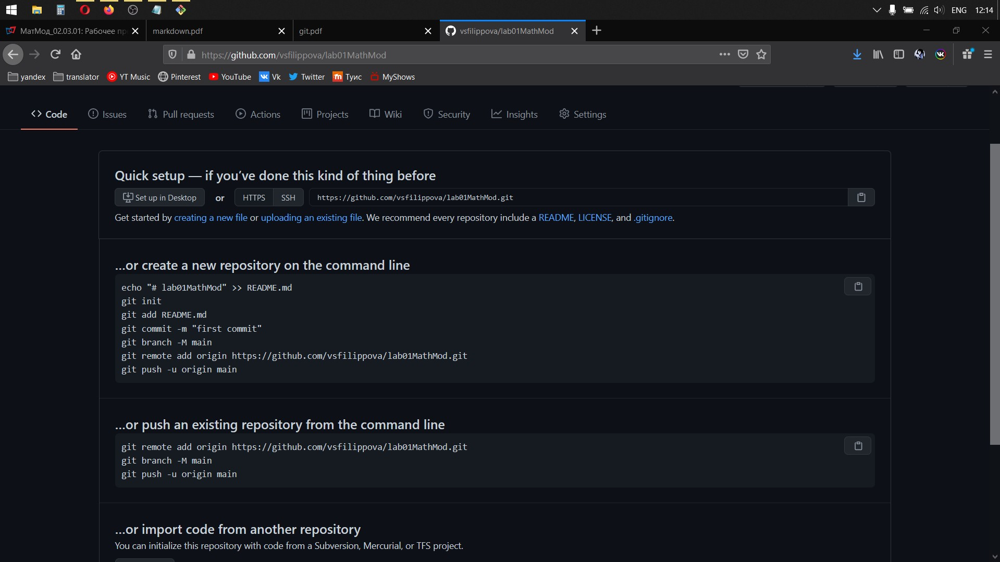
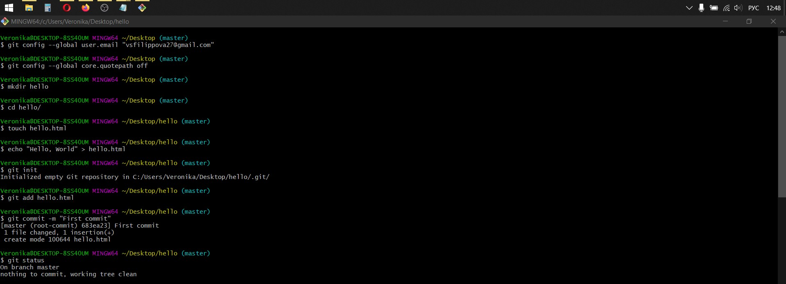
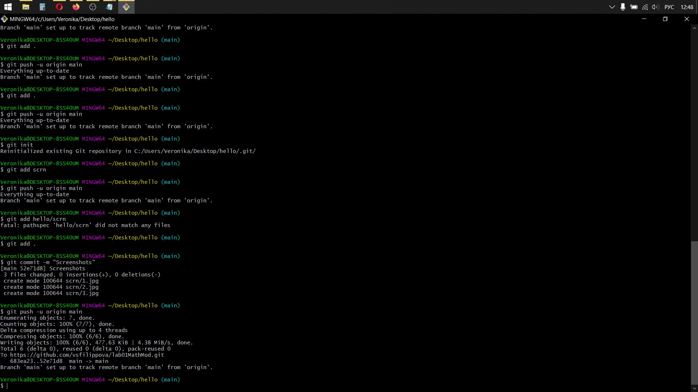
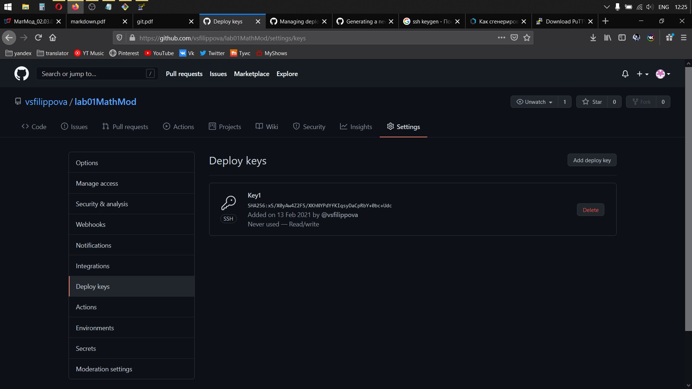
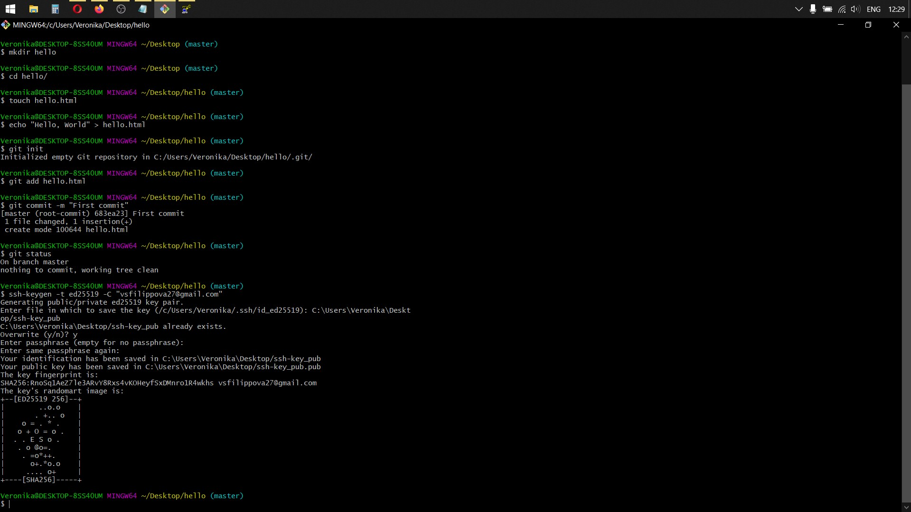
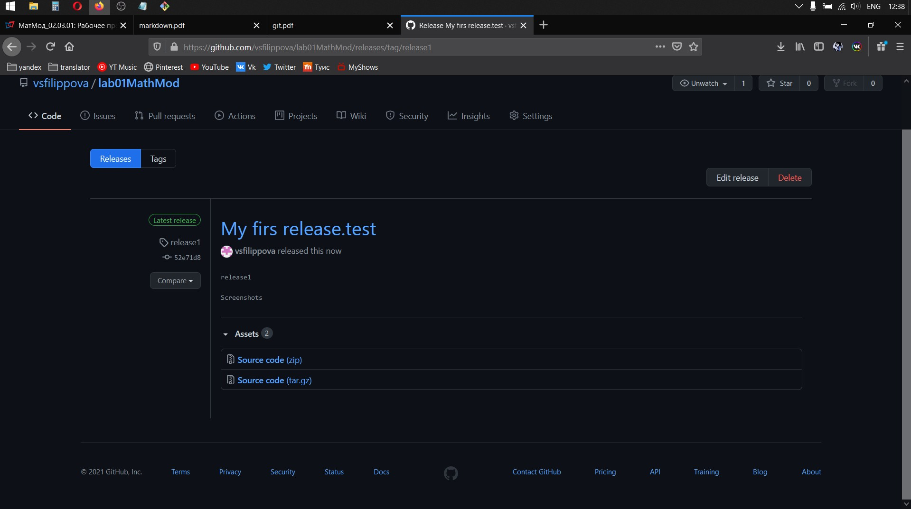

# **Данные о работе**

lang: ru-RU

title: Отчет по лабораторной работе №1

discipline: Математическое моделирование

theme: Github, Markdown

student: Филиппова Вероника Сергеевна

group:НКНбд-01-18

teacher: Кулябов Дмитрий Сергеевич

# **Цель работы**

Узнать как работать с github, а также познакомиться

с основными возможностями разметки Markdown.

# **Задачи**

1. Создать репозиторий на github.com
2. Создать и загрузить файлы на github.com
3. Сделать коммит и пуш
4. Создать и подключить ssh ключ
5. Сделать релиз на github.com
6. Оформить и загрузить отчет и презентацию в 3 форматах doc,pdf,md.

# **Объект и предмет исследования**

Github, Markdown

# **Cписок иллюстраций**
1. /scrn/1.jpg
2. /scrn/2.jpg
3. /scrn/3.jpg
4. /scrn/4.jpg
5. /scrn/5.jpg
6. /scrn/6.jpg

# **Выполнение лабораторной работы**

1. *Создала репозиторий на гитхаб (рис.1)*

{ Рис.1 }

2. *Создала и загрузила файлы на гитхаб (рис.2)*

{ Рис.2 }

3. *Сделать коммит и пуш (рис.3)*

{ Рис.3 }

4. *Создала и подключила ssh ключ*

{ Рис.4 }

{ Рис.5 }

5. *Сделала релиз на github.com*

{ Рис.6 }

6. *Оформила и загрузила отчет и презентацию*

# **Выводы**

Научилась работать с github.com, а так же познакомилась с основными разметками Markdown.
